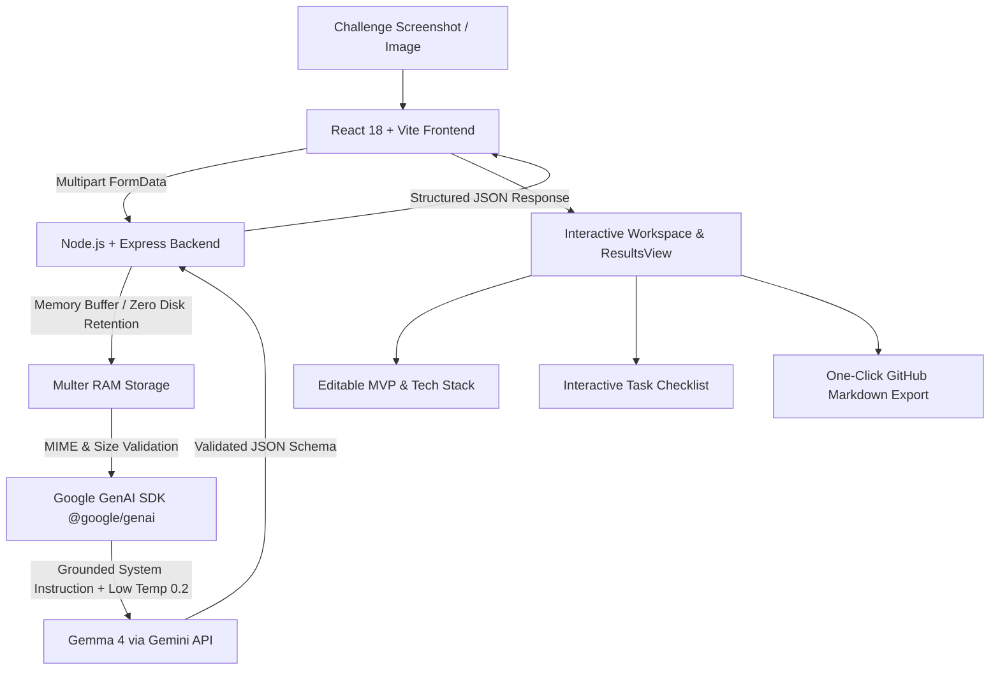

# Brief2Build AI ⚡
> **From Challenge Screenshot to Build-Ready Plan.**  
> *Hacktoberfest Hack Day 2026 (Hyderabad) — Official Entry for **Best Use of Gemma 4***

[](LICENSE)
[-4285F4.svg)](#ai-technology--prompt-engineering)
[](#technology-stack)
[](#deployment-on-render)

---

## 🎯 Problem Statement
During hackathons, engineering teams are handed complex challenge briefs, visual PDFs, diagrams, and requirements screenshots. Teams frequently struggle with:
1. **Misinterpreting implicit vs. explicit requirements**, leading to disqualification or building the wrong solution.
2. **Analysis Paralysis & Scope Creep**: Debating architecture and features for hours instead of coding.
3. **Unclear Task Division**: Lack of an ordered checklist tailored to the team's skillset.
4. **Poor Demonstration Preparation**: Forgetting key judging rubrics until the final 15 minutes.

General-purpose chatbots provide generic text summaries and hallucinate unstated rules. Hackathon participants need a **focused developer tool** that ingests visual briefs, extracts grounded facts with visual citations, and turns them into an editable build plan.

---

## 💡 Solution: Brief2Build AI
**Brief2Build AI** is a purpose-built workspace that allows participants to upload any hackathon challenge screenshot or requirement graphic, add team constraints, and analyze it using **Gemma 4** through the official Google Gemini API.

It automatically produces:
- 🟢 **Extracted Ground Truth**: Explicit requirements with direct visual text quotes as evidence.
- 🟡 **Uncertainties to Verify**: Ambiguous or unstated constraints requiring mentor confirmation.
- 🔵 **Focused MVP Scope**: A feasible prototype proposal fitting the hackathon timeframe.
- 🔵 **Reasoned Technology Stack**: Every tool and library justified for speed and reliability.
- 📋 **Interactive Team Checklist**: Live task board with completion tracking and custom task support.
- ⏱️ **Two-Minute Judge Demo Sequence**: Timing-targeted pitch flow (0–120s) mapped to judging criteria.
- 📄 **One-Click Export**: Full GitHub-ready Markdown plan and JSON export.

---

## 👤 Primary User Story
> *"As a hackathon participant, I want to upload a screenshot of my challenge statement and receive a structured, editable build plan, so that my team can understand the requirements and begin implementation faster."*

---

## 🏗️ Architecture & Data Flow



### Key Architectural Highlights
- **Single-Service Render Deployment**: Express serves the production-built Vite client static bundle from `client/dist` and handles `/api` and `/health` routes from a single port.
- **In-Memory Privacy**: User images are parsed in RAM (`multer.memoryStorage()`) and directly streamed as base64 inline data to Gemma 4. No screenshots are saved to disk.
- **Strict Grounding & Provenance**: Every output card visibly distinguishes *Extracted from Image*, *AI Suggestion*, and *Needs Verification*.

---

## 🤖 AI Technology & Prompt Engineering

### Model Configuration
- **Model Family**: Gemma 4 (open-weights multimodal foundation model by Google).
- **Inference Route**: Google Gemini API via official `@google/genai` Node.js SDK.
- **Configurable Identifier**: Configured via the `GEMMA_MODEL` environment variable (defaults to `gemma-4` or organizer-provided endpoint).

### Grounded Prompt Design (`server/src/prompts/analyzePrompt.js`)
The system prompt enforces strict rules on the model:
1. **Strict Fact Extraction**: Extract only visible text/cues. Never invent rules or criteria.
2. **Visual Evidence Citations**: For each requirement, cite the visual snippet detected.
3. **Flag Ambiguities**: Unstated details (e.g. judging weights, platform limits) are routed to `uncertainties`.
4. **Low Temperature**: Set to `0.2` to maximize factual consistency and eliminate hallucinations.

### Response Schema
```json
{
  "title": "string",
  "summary": "string",
  "target_user": "string",
  "problem": "string",
  "extracted_requirements": [
    {
      "requirement": "string",
      "evidence": "short text found in input",
      "type": "explicit"
    }
  ],
  "constraints": ["string"],
  "deliverables": ["string"],
  "uncertainties": ["string"],
  "mvp": {
    "name": "string",
    "description": "string",
    "features": ["string"]
  },
  "technology_stack": [
    {
      "technology": "string",
      "reason": "string"
    }
  ],
  "implementation_plan": [
    {
      "step": 1,
      "title": "string",
      "description": "string",
      "estimated_minutes": 45
    }
  ],
  "tasks": [
    {
      "id": "task-1",
      "title": "string",
      "description": "string",
      "status": "pending"
    }
  ],
  "demo_flow": ["string"],
  "caveats": ["string"]
}
```

---

## 🛠️ Technology Stack

| Layer | Technology | Purpose |
|---|---|---|
| **Frontend** | React 18, Vite | High-performance SPA with fast module replacement |
| **Styling** | Tailwind CSS | Sleek, high-contrast dark developer-tool design |
| **Icons** | Lucide React | Accessible, lightweight icon set |
| **Backend** | Node.js, Express | REST API, static asset server, and proxy |
| **AI SDK** | `@google/genai` (v2.x) | Official Google SDK for Gemini API and Gemma models |
| **Uploads** | Multer (`memoryStorage`) | Secure in-memory multipart image streaming |
| **Hosting** | Render Web Service | Single-service production hosting with zero config |

---

## 🚀 Quickstart & Local Setup

### Prerequisites
- Node.js `v18+` (Tested on Node `v24`)
- npm `v9+`
- Google Gemini API Key

### 1. Clone the Repository
```bash
git clone https://github.com/YOUR_USERNAME/brief2build-ai.git
cd brief2build-ai
```

### 2. Install Dependencies
```bash
npm run install:all
```
*(This installs root, backend, and frontend dependencies in one command).*

### 3. Configure Environment Variables
Copy `.env.example` to `.env`:
```bash
cp .env.example .env
```
Open `.env` and set your API key:
```env
PORT=5000
NODE_ENV=development
GEMINI_API_KEY=your_actual_gemini_api_key
GEMMA_MODEL=gemma-4
```

### 4. Run Development Servers
```bash
npm run dev
```
- **Frontend UI**: [http://localhost:5173](http://localhost:5173) (Vite dev server with hot reload)
- **Backend API**: [http://localhost:5000](http://localhost:5000)
- **Health Check**: [http://localhost:5000/health](http://localhost:5000/health)

### 5. Run Production Build Locally (Render simulation)
```bash
npm run build
npm start
```
The application will be served directly from Express on [http://localhost:5000](http://localhost:5000).

---

## ⏱️ Two-Minute Judge Demo Guide

| Time Window | Demo Action | What Judges See |
|---|---|---|
| **00:00 – 00:15** | **The Hook** | Explain the core problem: teams waste hours deciphering screenshots instead of building. |
| **00:15 – 00:35** | **Input & Analyze** | Click **"Load Sample Challenge"** (or upload a custom brief). Notice the in-memory privacy badge. Click **"Analyze with Gemma 4"**. |
| **00:35 – 00:65** | **Grounded Proof** | Highlight **Extracted Requirements** showing exact visual text quotations (*evidence*) and **Uncertainties to Verify**. Prove zero hallucinations. |
| **00:65 – 00:95** | **Editable Workspace** | Edit the MVP description live. Check off completed tasks on the **Team Checklist** and watch the progress bar update. |
| **00:95 – 01:10** | **1-Click Export** | Click **"Copy Markdown"** and paste it into GitHub or notes to show instant collaboration value. |
| **01:10 – 01:20** | **Architecture & Deployment** | Show the live Render deployment URL and GitHub repository. |

---

## 🌐 Deployment on Render

Brief2Build AI is architected as a **single Node.js Web Service** on Render:

1. Create a **New Web Service** on [Render Dashboard](https://dashboard.render.com).
2. Connect your public GitHub repository.
3. Apply the settings (or use `render.yaml`):
   - **Environment**: `Node`
   - **Build Command**: `npm run install:all && npm run build`
   - **Start Command**: `npm start`
   - **Health Check Path**: `/health`
4. Add Environment Variables in the Render Dashboard:
   - `NODE_ENV`: `production`
   - `GEMMA_MODEL`: `gemma-4` (or model specified by organizers)
   - `GEMINI_API_KEY`: *(paste your private API key here)*
5. Click **Create Web Service**. Render will automatically build the client, host the Express server, and provide your public `https://brief2build-ai.onrender.com` URL.

---

## 🔒 Privacy & Security Standards
- **Zero API Keys in Client**: All Gemini API calls originate strictly from the Express server.
- **In-Memory Buffer Processing**: Uploaded images are never written to disk, preventing data leakage.
- **Strict `.gitignore`**: Protects `.env`, secrets, logs, and build artifacts from accidental commits.
- **Sanitized Errors**: The client receives user-friendly guidance; raw provider credentials are never leaked.

---

## 👥 Hackathon Team & Event Information
- **Event**: Hacktoberfest Hack Day 2026 (Hyderabad)
- **Challenge Track**: Best Use of Gemma 4
- **Project Name**: Brief2Build AI
- **Tagline**: From Challenge Screenshot to Build-Ready Plan
- **License**: [MIT](LICENSE)
