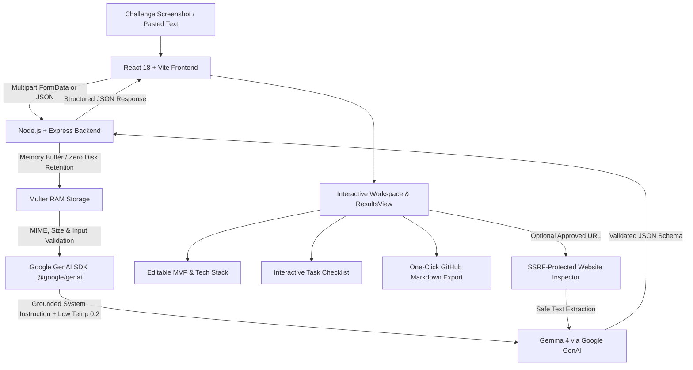

# Brief2Build AI ⚡
> **From Challenge Screenshot to Build-Ready Plan**

[](LICENSE)
[-4285F4.svg)](#ai-technology--prompt-engineering)
[](#technology-stack)
[](#deployment-on-render)

---

## 🎯 Problem Statement
When engineers, hackathon teams, and developers receive complex challenge briefs, visual PDFs, diagrams, or requirements screenshots, they frequently face:
1. **Misinterpreting implicit vs. explicit requirements**, leading to scope errors or building the wrong solution.
2. **Analysis Paralysis & Scope Creep**: Debating architecture and features for hours instead of coding.
3. **Unclear Task Division**: Lack of an ordered checklist tailored to the team's skillset.
4. **Poor Demonstration Preparation**: Forgetting key criteria until the final sprint.

General-purpose chatbots provide generic text summaries and hallucinate unstated rules. Developers need a **grounded developer tool** that ingests visual briefs, extracts grounded facts with visual citations, and turns them into an actionable, editable build plan.

---

## 💡 Solution: Brief2Build AI
**Brief2Build AI** is a purpose-built workspace that allows developers to upload any challenge screenshot or requirement graphic, paste text briefs, add custom context, and analyze it using **Gemma 4** through the official Google Gemini API (`@google/genai`).

It automatically produces:
- 🟢 **Extracted Ground Truth**: Explicit requirements with direct visual text quotes as evidence.
- 🟡 **Uncertainties to Verify**: Ambiguous or unstated constraints requiring confirmation.
- 🔵 **Focused MVP Scope**: A feasible prototype proposal fitting the execution timeframe.
- 🔵 **Reasoned Technology Stack**: Every tool and library justified for speed and reliability.
- 📋 **Interactive Team Checklist**: Live task board with completion tracking and custom task support.
- ⏱️ **Targeted Demo Sequence**: Timing-targeted pitch flow (0–120s) mapped to deliverable criteria.
- 🌐 **Safe Website Inspection**: Detected reference URLs in briefs can be inspected upon explicit user approval, protected by a robust SSRF shield.
- 📄 **One-Click Export**: Full GitHub-ready Markdown plan and JSON export.

---

## 🏗️ Architecture & Data Flow



### Key Architectural Highlights
- **Single-Port Unified Service**: Express serves the compiled Vite client bundle statically from `client/dist` and handles `/api/*` and `/health` from a single port (`http://localhost:5000`).
- **In-Memory Privacy**: User images are parsed in RAM (`multer.memoryStorage()`) and directly streamed as base64 inline data to Gemma 4. Zero screenshots are saved to disk.
- **Strict Grounding & Provenance**: Every output card visibly distinguishes *Extracted from Image*, *AI Suggestion*, and *Needs Verification*.
- **SSRF Shielded URL Inspector**: Restricts fetches to HTTP/HTTPS, blocks localhost (`127.0.0.1`, `::1`), RFC 1918 private subnets (`10.0.0.0/8`, `172.16.0.0/12`, `192.168.0.0/16`), AWS/cloud metadata (`169.254.169.254`), and validates redirect targets manually.

---

## 🤖 AI Technology & Prompt Engineering

### Model Configuration
- **Model Family**: Gemma 4 (Google open-weights multimodal foundation models).
- **Inference Route**: Google Gemini API via official `@google/genai` Node.js SDK.
- **Configurable Identifier**: Supported via `GEMMA_MODEL_ID` or `GEMMA_MODEL` (defaults to `gemma-4-26b-a4b-it` for multimodal vision or `gemma-4-31b-it` for text).
- **API Keys Supported**: `GOOGLE_API_KEY` or `GEMINI_API_KEY`.

### Grounded Prompt Design (`server/src/prompts/analyzePrompt.js`)
The system prompt enforces strict rules on the model:
1. **Strict Fact Extraction**: Extract only visible text/cues. Never invent rules or criteria.
2. **Visual Evidence Citations**: For each requirement, cite the visual snippet detected.
3. **Flag Ambiguities**: Unstated details (e.g. judging weights, platform limits) are routed to `uncertainties`.
4. **Low Temperature**: Set to `0.2` to maximize factual consistency and eliminate hallucinations.

---

## 🛠️ Technology Stack

| Layer | Technology | Purpose |
|---|---|---|
| **Frontend** | React 18, Vite | High-performance SPA with fast module replacement |
| **Styling** | Vanilla CSS + Tailwind CSS utilities | Sleek, high-contrast dark developer-tool design |
| **Icons** | Lucide React | Accessible, lightweight icon set |
| **Backend** | Node.js, Express | REST API, static asset server, and proxy |
| **AI SDK** | `@google/genai` (v2.x) | Official Google SDK for Gemini API and Gemma models |
| **Uploads** | Multer (`memoryStorage`) | Secure in-memory multipart image streaming |
| **Hosting** | Render Web Service | Single-service production hosting with zero config |

---

## 🚀 Quickstart & Local Setup

### Prerequisites
- Node.js `v18+` (Tested on Node `v24`)
- npm `v9+`
- Google Gemini API Key

### 1. Clone the Repository
```bash
git clone https://github.com/YOUR_USERNAME/brief2build-ai.git
cd brief2build-ai
```

### 2. Install Dependencies
```bash
npm run install:all
```
*(This installs root, backend, and frontend dependencies).*

### 3. Configure Environment Variables
Copy `.env.example` to `.env`:
```bash
cp .env.example .env
```
Open `.env` and set your API key:
```env
PORT=5000
NODE_ENV=development
GOOGLE_API_KEY=your_actual_google_api_key
GEMMA_MODEL_ID=gemma-4-26b-a4b-it
```

### 4. Build and Run Unified Server (Single URL)
```bash
npm run build
npm start
```
The entire application (Frontend + Backend API + Health check) is accessible on:
👉 **`http://localhost:5000`**

- **Web Application**: [http://localhost:5000](http://localhost:5000)
- **Health Check Endpoint**: [http://localhost:5000/health](http://localhost:5000/health)
- **API Model Config**: [http://localhost:5000/api/analyze/config](http://localhost:5000/api/analyze/config)

---

## 🧪 Testing Suite

Run all automated unit and integration tests:
```bash
npm test
```
The test suite validates:
- Server startup and `/health` response.
- In-memory Multer image upload handling.
- Input validation (missing file or text rejection, file size limits).
- SSRF prevention (blocking `127.0.0.1`, `localhost`, `169.254.169.254`, private RFC 1918 IPs, and malicious redirect hops).
- Gemma 4 prompt grounding and structured JSON parser.

---

## 🌐 Deployment on Render

Brief2Build AI is architected as a **single Node.js Web Service** on Render:

1. Create a **New Web Service** on [Render Dashboard](https://dashboard.render.com).
2. Connect your GitHub repository.
3. Apply the settings (or use `render.yaml`):
   - **Environment**: `Node`
   - **Build Command**: `npm run install:all && npm run build`
   - **Start Command**: `npm start`
   - **Health Check Path**: `/health`
4. Add Environment Variables in the Render Dashboard:
   - `NODE_ENV`: `production`
   - `GOOGLE_API_KEY`: *(paste your private Google GenAI API key)*
   - `GEMMA_MODEL_ID`: `gemma-4-26b-a4b-it`
5. Click **Deploy Web Service**. Render will automatically build the client, host the Express server, and provide your public `https://brief2build-ai.onrender.com` URL.

---

## 🔒 Privacy & Security Standards
- **Zero API Keys in Client**: All Gemini API calls originate strictly from the Express server.
- **In-Memory Buffer Processing**: Uploaded images are never written to disk, preventing data leakage.
- **SSRF Defense**: Strict destination IP, DNS, scheme, and redirect verification for URL retrieval.
- **Strict `.gitignore`**: Protects `.env`, secrets, logs, and build artifacts from accidental commits.
- **Sanitized Errors**: The client receives user-friendly guidance; raw provider credentials are never leaked.

---

## 📄 License
[MIT](LICENSE)
